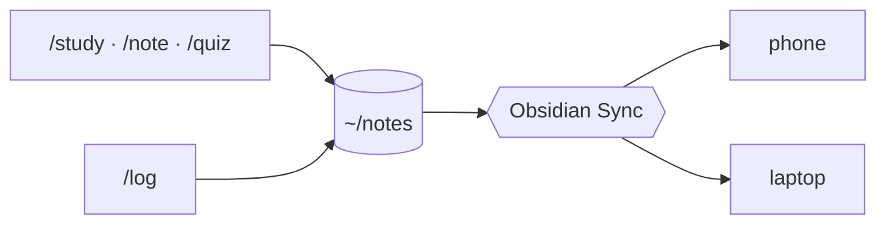

# danwiththehat-skills

```text
      _____
     |     |
   __|_____|__     one person, many hats.
     ( -_- )
```

I switch roles a lot in a day: student in the morning, analyst after lunch, engineer when something breaks, and the person who can't remember what they did yesterday at standup. Each plugin here is one of those hats. Put it on, and Claude knows how to help with that job, and **remembers** what happened last time.

Nothing fancy. Plain Markdown in, plain Markdown out. Notes end up in Obsidian so I can read them on my phone on the bus.

---

## 01 · The student hat `learning`

For when I'm trying to actually understand something, not just skim it.

| Command | What happens |
|---|---|
| `/study paged attention` | A proper lesson: asks what I already know, builds up in layers, makes me explain it back |
| `/note vllm prefix caching reuses KV pages for shared prompts` | One line in, filed under today and under the topic. No lecture |
| `/quiz vllm` | Goes straight for what I got wrong last time. Honest grading, 1 to 5 |
| `/materials vllm flashcards` | Flashcards I can flip through in Obsidian while waiting for coffee |
| `/note review` | "What did I learn this week?" plus which topics are overdue for a quiz |

It works in Vietnamese too: *"note lại: hôm nay học được..."* is fine.

## 02 · The logbook hat `productivity`

Because "what did you do yesterday?" should not require archaeology.

```markdown
## Work log
- 09:40 ✅ Ship retry logic for webhook sender [[Webhook Retry]]
- 14:10 ⛔ blocked: staging migration, waiting on [[teammate]]
- [ ] Write rollout note [[Webhook Retry]]
```

- `/log fixed the flaky export test` adds a line to today's note
- `/log standup` gives me yesterday / today / blockers, ready to paste
- `/log recap week` shows what got done per project and which todos are going stale
- Can draft entries from today's `git log` if I forgot to log as I went (asks before writing)

## 03 · The analyst hat `data-analytics`

A SQL analyst that learns the warehouse as it goes. Big vague question in, queries and a clear answer out, and every table quirk it trips over gets written down so it never trips twice.

- **`da-sql`**: recall what it knows → write and run SQL (dry run first, it respects the bill) → save what it learned
- **`/deep-analyze <topic>`**: agree on the metric → plan → overall trend → break down by users and by product → recommendations, each tagged with how confident it really is

## 04 · The engineer hat `engineering`

- **`/test-driven-development`**: one failing test, make it pass, clean up, repeat. Small vertical slices, no big-bang PRs
- **`/improve-codebase-architecture`**: finds the shallow, tangled bits and suggests how to make modules deeper and easier to test
- **`/python-code-standard`**: the one Python standard I use everywhere: formatter decides formatting, fail loudly, shapes are contracts, test invariants, every result traceable to a commit. Sets up new projects and audits old ones without changing behaviour
- **`/markdown-style`**: the same idea for docs and notes: bullets over prose, sentences a newcomer understands, one title, code fenced with its language, links that say where they go. Tidies a pile of notes without losing a single fact
- **`/design-patterns`**: before adding a class, a factory or a fifth `elif`, it asks what actually changes and picks the smallest thing that handles it, in plain Python. Also knows the ML ones: one engine for many models, experiments as configs, a baseline before any model

---

## Putting a hat on

Each hat lives in its own folder with its own `CLAUDE.md`. Open Claude Code **inside that folder** and the commands are there:

```bash
git clone https://github.com/dannhh/danwiththehat-skills.git
cd danwiththehat-skills/plugins/learning/skills/concept-learner
claude
```

| Hat | Folder |
|---|---|
| 01 student | `plugins/learning/skills/concept-learner` |
| 02 logbook | `plugins/productivity/skills/worklog` |
| 03 analyst | `plugins/data-analytics/skills/da-sql` |
| 04 engineer | `plugins/engineering/skills/engineering` |

<details>
<summary>Marketplace / <code>npx skills</code></summary>

<br>

```bash
/plugin marketplace add https://github.com/dannhh/danwiththehat-skills.git
npx skills add https://github.com/dannhh/danwiththehat-skills.git
```

Heads up: the skills sit in nested `.claude/skills/` folders, so `/plugin install` registers the plugins but doesn't load their commands. The folder way above is the one that works.
</details>

## Where the notes go

The student and logbook hats write into one Obsidian vault, laid out as an LLM wiki: I read and jot, Claude files and links. The layout follows [obsidian-second-brain](https://github.com/eugeniughelbur/obsidian-second-brain) and [Karpathy's LLM Wiki](https://gist.github.com/karpathy/442a6bf555914893e9891c11519de94f).



```text
~/notes/
├── _CLAUDE.md         ← the vault's rulebook; every skill defers to it
├── CLAUDE.md          ← one line, `@_CLAUDE.md`, so Claude Code loads it
├── index.md           ← one line per note, read first
├── log.md             ← append-only history of what Claude did
├── raw/               ← sources I clip; never edited
└── wiki/
    ├── daily/         ← one note a day: work log, learned, decisions, tasks
    ├── concepts/      ← things I learned, with quiz history
    ├── entities/      ← tools, libraries, people
    ├── projects/      ← context and key decisions
    ├── logs/  reviews/  decisions/
```

Daily notes are the inbox. Once a week, Claude promotes what lasts (lessons, decisions, tools) into the wiki and leaves tasks where they are.

**Setup, once:**

1. Tell the skills where the vault is, in `~/.claude/settings.json`, then restart Claude Code:

   ```json
   { "env": { "NOTES_DIR": "/Users/<you>/notes" } }
   ```

2. Obsidian → **Open folder as vault** → `~/notes`, and turn on **Sync** (iCloud or git work too).
3. Nice to have: the **Spaced Repetition** and **Dataview** community plugins.

No `NOTES_DIR`? The skills stop and ask for it rather than writing notes into the repo.

## Sewing a new hat

```text
plugins/<plugin>/
├── .claude-plugin/plugin.json
└── skills/<skill>/
    ├── CLAUDE.md
    └── .claude/skills/<command>/SKILL.md
```

1. Write the `SKILL.md` (frontmatter `name` must match its folder). [BEST_PRACTICES.md](./BEST_PRACTICES.md) has the rules, especially for `description`
2. `python3 scripts/build.py` to refresh `marketplace.json` and plugin versions
3. `bash scripts/test-integration.sh` for the end-to-end check
4. Commit the skill and the manifests together

<div align="center">
<br>
<sub>made with a hat on</sub>
</div>
